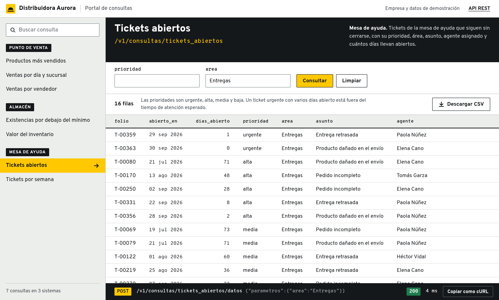
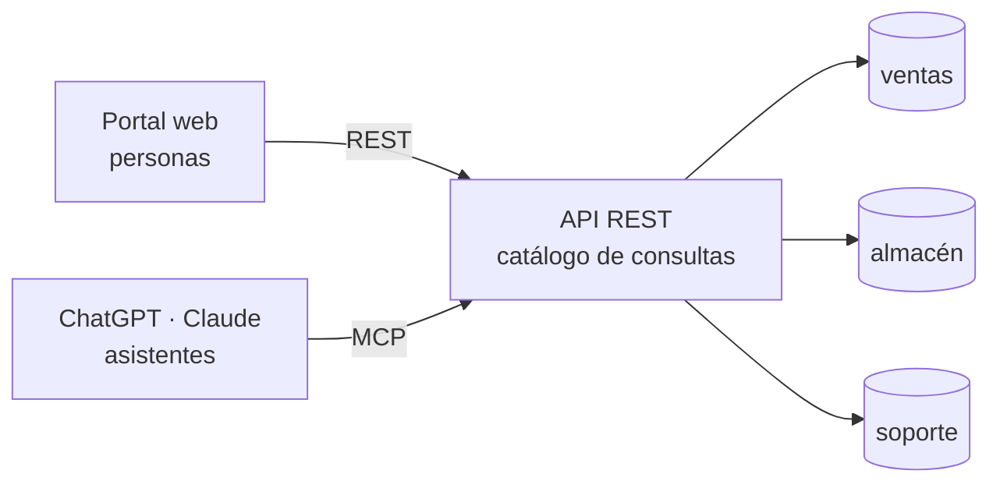

<div align="center">

# Tus sistemas internos, como tools para ChatGPT y Claude

**Un YAML por consulta. Una API REST. Tres líneas para volverla servidor MCP.**

[](LICENSE)


</div>

La información que tu equipo necesita ya existe: vive en el punto de venta, en el almacén, en la mesa
de ayuda. Lo que falta es que alguien pueda preguntarle a su asistente «¿cuánto vendimos ayer?» y
reciba la respuesta con datos de hoy, sin que nadie construya otro chatbot ni otro tablero.

Este proyecto es esa pieza. Declaras tus consultas en archivos YAML, se publican como una API REST, y
esa misma API se convierte en un servidor [MCP](https://modelcontextprotocol.io) que ChatGPT, Claude o
cualquier cliente compatible puede usar. El servicio solo entrega filas: las gráficas, los cruces y
los reportes los arma el asistente.



## Por qué usarlo

- **No reescribes nada.** Se conecta a las bases que ya tienes, en solo lectura, y tu API existente
  sigue intacta: el MCP se monta encima.
- **Agregar una consulta es un archivo.** Un YAML nuevo aparece al mismo tiempo en la API, en el
  portal web y en las tools del asistente. Cero líneas de Python.
- **El asistente nunca escribe SQL.** Elige una consulta de un catálogo curado y le pasa valores a
  parámetros declarados. No ve el esquema ni recibe credenciales.
- **Varios sistemas, un solo catálogo.** Cada consulta dice de qué sistema lee; el asistente puede
  combinar ventas con inventario aunque esas bases no se conozcan.
- **Pequeño de verdad.** Cuatro archivos de Python, unas 250 líneas. Se lee completo en un café.

## Pruébalo con un comando

```bash
git clone https://github.com/zamax14/MCP-MexAI.git
cd MCP-MexAI
docker compose up --build
```

| | |
| --- | --- |
| Portal web | http://localhost:8080 |
| API REST | http://localhost:8000/v1/consultas · consola interactiva en [`/docs`](http://localhost:8000/docs) |
| Servidor MCP | http://localhost:8000/mcp |

Trae una empresa de ejemplo lista para consultar, **Distribuidora Aurora**, con tres sistemas
internos y datos sintéticos que siempre llegan hasta el día de hoy.

## Cómo funciona



El portal y el MCP son dos productos distintos que no se conocen entre sí. Los dos son clientes de la
misma API: uno le muestra una tabla a una persona, el otro le entrega los datos a un asistente.

### De API a MCP en tres líneas

La API vive en [`app/api.py`](app/api.py) y no sabe nada de MCP. Todo lo que hace falta para tenerlo
está en [`app/main.py`](app/main.py):

```python
from fastapi import FastAPI
from fastmcp import FastMCP

from app.api import app as api

mcp = FastMCP.from_fastapi(app=api, name="Consultas de Distribuidora Aurora")
mcp_app = mcp.http_app(path="/mcp")

app = FastAPI(routes=[*mcp_app.routes, *api.routes], lifespan=mcp_app.lifespan)
```

Cada ruta se vuelve una tool. El nombre sale de su `operation_id`, la descripción de su docstring y
el esquema de sus tipos:

| Ruta REST | Tool MCP | Qué hace |
| --- | --- | --- |
| `GET /v1/consultas` | `listar_consultas` | Descubre qué se puede preguntar |
| `GET /v1/consultas/{id}` | `describir_consulta` | Explica una consulta y sus parámetros |
| `POST /v1/consultas/{id}/datos` | `ejecutar_consulta` | Devuelve las filas, al momento |

El mismo bloque sirve para tu propia API de FastAPI: importa tu `app` en lugar de la de este
repositorio.

## Una consulta es un YAML

```yaml
# catalogo/ventas/ventas_por_categoria.yaml
id: ventas_por_categoria             # igual que el nombre del archivo
nombre: Ventas por categoría
sistema: ventas                      # igual que la carpeta; se conecta con la variable DSN_VENTAS
descripcion: Importe vendido por categoría de producto en el periodo.
notas: Importes en pesos mexicanos.  # opcional: la letra chica que debe acompañar al dato
parametros:
  - nombre: desde
    tipo: date                       # str, int o date
    descripcion: Primer día a incluir, en formato AAAA-MM-DD. Omitir para los últimos 30 días.
sql: |
  SELECT categoria, SUM(total)::numeric AS importe
  FROM ventas
  WHERE fecha >= COALESCE(CAST(:desde AS date), CURRENT_DATE - 30)
  GROUP BY categoria
  ORDER BY importe DESC
```

Guarda el archivo y listo: el servidor recarga solo y la consulta queda disponible en el portal, en
REST y en MCP.

La `descripcion` de la consulta y la de cada parámetro son lo que lee el asistente para decidir qué
llamar y con qué valores. Escribirlas bien es la diferencia entre un asistente que acierta y uno que
adivina.

Un manifiesto inválido impide arrancar y el error nombra el archivo. Se valida que no haya campos
desconocidos, que el `sql` empiece con `SELECT` o `WITH` y que los `parametros` declarados sean
exactamente los binds (`:nombre`) que usa el `sql`.

## Conéctalo a tu asistente

### En tu máquina

Cualquier cliente MCP que corra en tu equipo puede usar la URL local. Con Claude Code:

```bash
claude mcp add --transport http aurora http://localhost:8000/mcp
```

### Desde ChatGPT o claude.ai, con Tailscale Funnel

Los asistentes que corren en la nube necesitan una URL HTTPS pública.
[Tailscale Funnel](https://tailscale.com/kb/1223/funnel) publica un servicio local con certificado
válido y sin abrir puertos en tu red.

**Antes de empezar** necesitas Tailscale 1.38.3 o posterior con sesión iniciada, y MagicDNS y HTTPS
habilitados en tu tailnet. La primera vez que uses Funnel, el propio comando te da el enlace para
activarlo.

**1. Levanta el servicio**

```bash
docker compose up -d
```

**2. Publica solo la ruta del MCP**

```bash
tailscale funnel --bg --set-path /mcp http://127.0.0.1:8000/mcp
```

`--set-path /mcp` publica únicamente el servidor MCP: la API REST, su consola y el portal se quedan
en tu máquina. `--bg` lo deja corriendo en segundo plano, incluso si cierras la terminal.

**3. Obtén tu URL pública**

```bash
tailscale funnel status
```

```
https://tu-equipo.tu-tailnet.ts.net (Funnel on)
|-- /mcp proxy http://127.0.0.1:8000/mcp
```

Tu servidor MCP queda en `https://tu-equipo.tu-tailnet.ts.net/mcp`.

**4. Comprueba que responde desde internet**

```bash
curl -s -X POST https://tu-equipo.tu-tailnet.ts.net/mcp \
  -H 'Content-Type: application/json' \
  -H 'Accept: application/json, text/event-stream' \
  -d '{"jsonrpc":"2.0","id":1,"method":"initialize","params":{"protocolVersion":"2025-06-18","capabilities":{},"clientInfo":{"name":"curl","version":"1"}}}'
```

Si ves `"serverInfo":{"name":"Consultas de Distribuidora Aurora", ...}`, el túnel funciona. La primera
petición puede tardar unos segundos mientras se emite el certificado.

**5. Regístralo en tu asistente**

Agrega esa URL como conector o servidor MCP personalizado, sin autenticación. El menú exacto y el
plan que lo permite cambian con cada producto, así que conviene revisar su documentación vigente.

**6. Apágalo al terminar**

```bash
tailscale funnel --https=443 --set-path=/mcp off
```

<details>
<summary>Variantes y problemas comunes</summary>

- **El puerto 443 ya lo usa otro servicio tuyo.** Funnel también acepta 8443 y 10000:
  `tailscale funnel --bg --https=8443 --set-path /mcp http://127.0.0.1:8000/mcp`. La URL queda como
  `https://tu-equipo.tu-tailnet.ts.net:8443/mcp`.
- **Quieres publicar también la API REST.** `tailscale funnel --bg 8000` expone el puerto completo,
  incluida la consola `/docs`.
- **«Access denied» en Linux.** Ejecuta el comando con `sudo`, o date permiso una sola vez con
  `sudo tailscale set --operator=$USER`.
- **Quieres borrar toda la configuración de Funnel del equipo.** `tailscale funnel reset`. Ojo: quita
  también lo que otros proyectos tengan publicado.
- **El destino debe ser `http://127.0.0.1`.** Funnel solo hace de proxy hacia esa dirección.

</details>

> [!WARNING]
> El servicio **no tiene autenticación**. Mientras el Funnel esté encendido, cualquiera con la URL
> puede ejecutar las consultas. Úsalo así solo con datos de prueba y apágalo al terminar.

## El ejemplo incluido

| Sistema | Base | Consultas |
| --- | --- | --- |
| Punto de venta | `ventas` | `ventas_por_dia`, `productos_mas_vendidos`, `ventas_por_vendedor` |
| Almacén | `almacen` | `existencias_bajo_minimo`, `valor_inventario` |
| Mesa de ayuda | `soporte` | `tickets_abiertos`, `tickets_por_semana` |

Pregúntale a tu asistente:

- ¿Cuánto vendimos ayer en cada sucursal?
- Grafica las ventas diarias de las últimas ocho semanas por sucursal. ¿Alguna va a la baja?
- De los cinco productos que más se venden, ¿cuáles están por debajo del mínimo en algún almacén?
- Hazme un reporte de los tickets urgentes y de prioridad alta que siguen abiertos.

La tercera cruza dos sistemas que no se conocen entre sí: el asistente llama una consulta de ventas,
otra de almacén, y las une por SKU. Nadie programó ese reporte.

Distribuidora Aurora no existe y todos sus datos son sintéticos. Las fechas se siembran alrededor del
día en que se crea la base, así que hay ventas de ayer durante los seis meses siguientes. Para
resembrar desde cero: `docker compose down -v`.

## Llévalo a tus sistemas

1. **Conecta tu base.** Agrega una variable `DSN_<SISTEMA>` al servicio `api` en
   [`compose.yaml`](compose.yaml), con un usuario que solo tenga permiso de lectura.
2. **Declara tus consultas.** Crea `catalogo/<sistema>/` y pon ahí un YAML por cada pregunta que
   quieras poder responder.
3. **Quita el ejemplo.** Borra las carpetas de `catalogo/` que no uses y el servicio `db`, junto con
   el `depends_on` que lo espera.

## Qué cuida y qué no

| Cuida | |
| --- | --- |
| El `sql` nunca sale del servidor | Ni en REST, ni en MCP, ni en los errores |
| Sin inyección | Los valores viajan como binds; nunca se arma SQL con cadenas |
| Solo lectura | La transacción es de solo lectura y el rol de la base solo tiene `SELECT` |
| Nada se trunca en silencio | Un resultado que excede el límite falla y dice con qué acotar |
| Catálogo validado al arrancar | Un manifiesto inválido detiene el servicio en vez de fallar después |

**No incluye autenticación, permisos por usuario ni límite de peticiones.** Es una base para aprender
y para demos; antes de conectarlo a datos reales hay que ponerle identidad y control de acceso.

## Estructura

```
app/catalog.py    carga y valida los manifiestos
app/engine.py     ejecuta las consultas: binds, solo lectura, límite de filas
app/api.py        la API REST
app/main.py       el bloque que la vuelve servidor MCP
catalogo/         un YAML por consulta, en una carpeta por sistema
db/               las tres bases de ejemplo
web/index.html    el portal, un HTML estático que solo usa la API
web/fonts/        la tipografía del portal, servida desde el propio repositorio
tests/            pruebas que no necesitan base de datos
```

Para correr las pruebas:

```bash
docker compose exec api python -m pytest -p no:cacheprovider
```

## Origen y licencia

Nació como la demo de la charla «MCP: deja de reinventar la rueda» para MexAI Community. Se publica
bajo licencia [MIT](LICENSE): úsalo, modifícalo y llévalo a tu empresa.

Las diapositivas de la charla están en [`output/`](output/), con las notas del ponente; se generan con
`redesign_deck.mjs` a partir de las ilustraciones de [`assets/`](assets/).

El portal usa las tipografías Overpass y Overpass Mono, incluidas en [`web/fonts/`](web/fonts/) bajo la
licencia SIL Open Font License 1.1.
